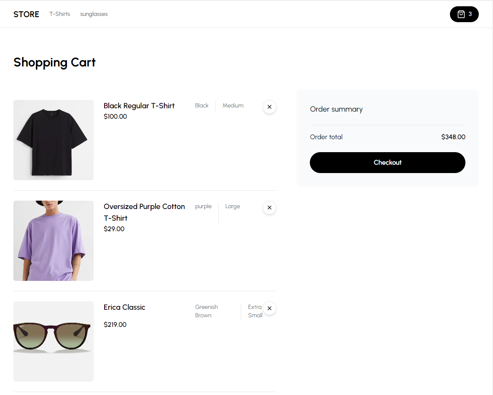
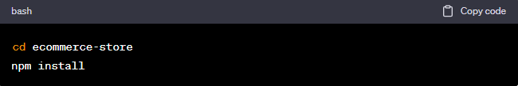
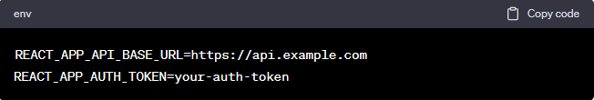
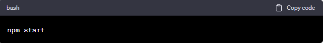

<h1>Ecommerce Store</h1>
<h3>Welcome to the Ecommerce Store project! This is an online shopping platform that allows users to browse and purchase various products from different categories.</h3>

<h2>Live Demo</h2>
Check out the live demo of the Ecommerce Store:  <a href= https://ecommerce-store-zeta-sable.vercel.app target="_blank"> Ecommerce Store Live Demo. 

<h2>Features</h2>
<b>Browse Categories:</b> Explore a wide range of product categories available in the store. 
<b>Product Search:</b> Easily search for products using keywords. 
<b>Product Details:</b> View detailed information about each product, including images, descriptions, and prices. 
<b>Add to Cart:</b> Add desired products to the shopping cart for later purchase. 
<b>Cart Management:</b> Manage the items in your cart, update quantities, and remove products. 
<b>Checkout:</b> Seamlessly proceed to the checkout process and place your order. 
<b>User Authentication:</b> Create an account, log in, and securely manage your profile. 
<b>Order History:</b> Keep track of previous orders and order statuses.

<h2>Tech Stack</h2>
<h3>The Ecommerce Store is built using the following technologies:</h3>  

Frontend: <b>HTML, CSS, Tailwind CSS, React.js, TypeScript, Next.js, Headless UI, PostCSS</b>  
Backend: <b>Next.js, Stripe, Zustand, Axios, Recharts, Zod, Next Cloudinary, Next Themes</b>  
Database: <b>Prisma</b>  
Deployment: <b>Vercel</b>  
<h3>Getting Started </h3>
To run the project locally, follow these steps:

<h3>Clone the repository:</h3>

<h3>Install dependencies:</h3>

Set up environment variables:
Create a .env file in the root directory and add the necessary environment variables, such as:

Start the development server:

Open your web browser and navigate to http://localhost:3000 to see the app in action

<h2>Contributing</h2>
I welcome contributions to improve the Ecommerce Store project. If you find any bugs, have feature requests, or want to contribute in any other way, please open an issue or submit a pull request.
